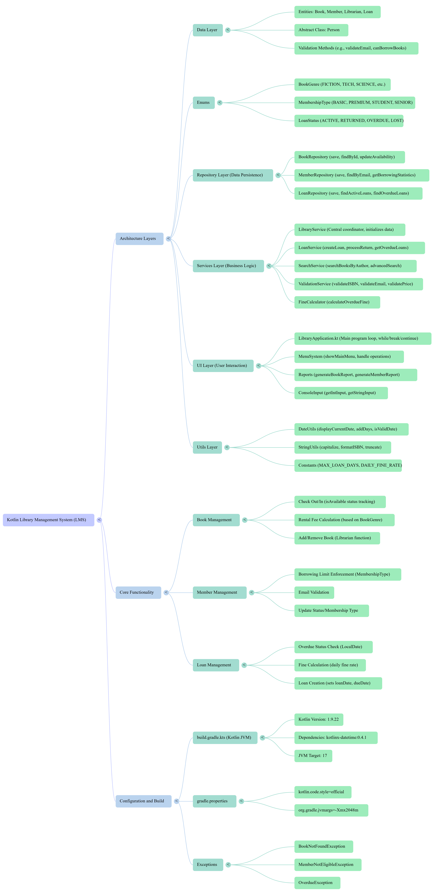

# 📚 Kotlin Library Management System (LMS)

**A complete, console-based Library Management System (LMS) built purely in Kotlin, designed using a robust Layered Architecture and Object-Oriented Principles.**

This project demonstrates structured Kotlin programming by managing core library operations, including book inventory, member tracking, loan processing, reporting, and validation using distinct architectural layers.

---

## ▶️ Project Overview & Demonstration

Check out the following video link for a detailed walkthrough of the project structure, features, and execution flow:

**[Project Demo & Explanation]**

[https://notebooklm.google.com/notebook/b8d4a22b-ce59-4d3b-8c4a-3605f07922d6?artifactId=ed69bb09-919b-41ec-a2ca-029596d79477](https://notebooklm.google.com/notebook/b8d4a22b-ce59-4d3b-8c4a-3605f07922d6?artifactId=ed69bb09-919b-41ec-a2ca-029596d79477)

[https://notebooklm.google.com/notebook/b8d4a22b-ce59-4d3b-8c4a-3605f07922d6?artifactId=ab47a723-67f8-4d05-a3cb-efab5335a0ea](https://notebooklm.google.com/notebook/b8d4a22b-ce59-4d3b-8c4a-3605f07922d6?artifactId=ab47a723-67f8-4d05-a3cb-efab5335a0ea)

[https://notebooklm.google.com/notebook/b8d4a22b-ce59-4d3b-8c4a-3605f07922d6?artifactId=766017c6-0b13-4b1b-9dff-2ead43f7dadf](https://notebooklm.google.com/notebook/b8d4a22b-ce59-4d3b-8c4a-3605f07922d6?artifactId=766017c6-0b13-4b1b-9dff-2ead43f7dadf)

---
## ✨ Features and Capabilities

This **Kotlin Library Management System** implements a wide range of functionalities, driven by clear separation of concerns across its architectural layers:

### 1. Core Entities and Data Models
*   **Books:** Track properties like title, author, ISBN, price, genre (`BookGenre`), and availability status (`isAvailable`). Books include logic to `checkOut()` and `checkIn()`.
*   **Members:** Members extend the `Person` class. They possess a `MembershipType` (e.g., BASIC, PREMIUM) which dictates their `loanLimit`. Members include methods to manage borrowed books and check eligibility to borrow.
*   **Librarians:** Extend `Person` and are equipped with an `adminLevel` to perform tasks such as adding and removing books, and approving memberships.
*   **Loans:** Loans track the relationship between books and members, logging the `loanDate`, `dueDate`, return status (`LoanStatus`), and fine calculation logic.

### 2. Operational Logic
*   **Loan Processing:** The `LoanService` handles the creation of new loans, automatically setting a due date (e.g., 14 days by default, based on internal logic). The system ensures a member can borrow a book only if they are active and under their loan limit.
*   **Fine Calculation:** Loans can calculate fines based on whether the loan is overdue (`isOverdue`). The calculation uses a daily fine rate of `1.0` based on overdue days.
*   **Validation:** Services exist to validate crucial data inputs, including ISBN format (requiring 13 digits) and email structure.
*   **Searching:** Users can search for books by author or genre, and search for members by name or membership type using criteria.

### 3. User Interface (UI)
*   The application uses a `MenuSystem` in the `UI Layer` for interactive console management.
*   The main program utilizes a `while` loop for continuous operation and a `when` statement to direct flow between the main operational menus (Member, Book, Loan, Reports, Exit).
*   **Reports:** Built-in reports can display statistics such as total books, available books, active member counts, and membership distribution.

---

## 🏗️ Architecture Overview

The project is strictly divided into five layers, ensuring modularity and maintainability.



| Layer | Responsibility | Example Components | Source Support |
| :--- | :--- | :--- | :--- |
| **Data** | Entity Models, State, and Enums | `Book`, `Member`, `Loan`, `BookGenre`, `MembershipType` | |
| **Repository** | In-memory Data Persistence (CRUD) | `BookRepository`, `MemberRepository`, `LoanRepository` | |
| **Services** | Business Logic, Orchestration, Validation | `LibraryService`, `LoanService`, `SearchService` | |
| **UI** | Console Interaction and User Display | `MenuSystem`, `Reports`, `ConsoleInput` | |
| **Utils** | Helper Functions | `DateUtils` (e.g., `addDays`), `StringUtils` (e.g., `capitalize`) | |

---

## 🛠️ Technology Stack

*   **Language:** **Kotlin** (Compiled with version **1.9.22**).
*   **Target:** JVM Target 17.
*   **Build Tool:** Gradle (using Kotlin DSL: `build.gradle.kts`).
*   **Dependencies:** Standard Kotlin libraries and `org.jetbrains.kotlinx:kotlinx-datetime:0.4.1` for efficient date handling.

---

## 🚀 Getting Started

The application is bundled using Gradle. The main entry point is `com.library.LibraryApplication`.

### Prerequisites
You need a JVM environment capable of running Java 17.

### Build and Run Instructions

1.  Place all source files according to the documented directory structure.
2.  Navigate to the project root directory.
3.  Execute the following commands:

```bash
# Build the project (ensures compatibility with Kotlin 1.9 and JVM 17)
./gradlew clean build

# Run the application
./gradlew run
```
The application will start by initializing sample data and displaying the current date.

### Sample Console Output (Main Menu)

Upon execution, the system displays the main menu, allowing navigation to Member, Book, Loan, or Report operations:

```
=== Welcome to Library Management System ===
Current Date: YYYY-MM-DD

=== Main Menu ===
1. Member Operations
2. Book Operations
3. Loan Operations
4. Reports
5. Exit
Choose option: 
```


Choosing option `5` gracefully exits the main program loop.
